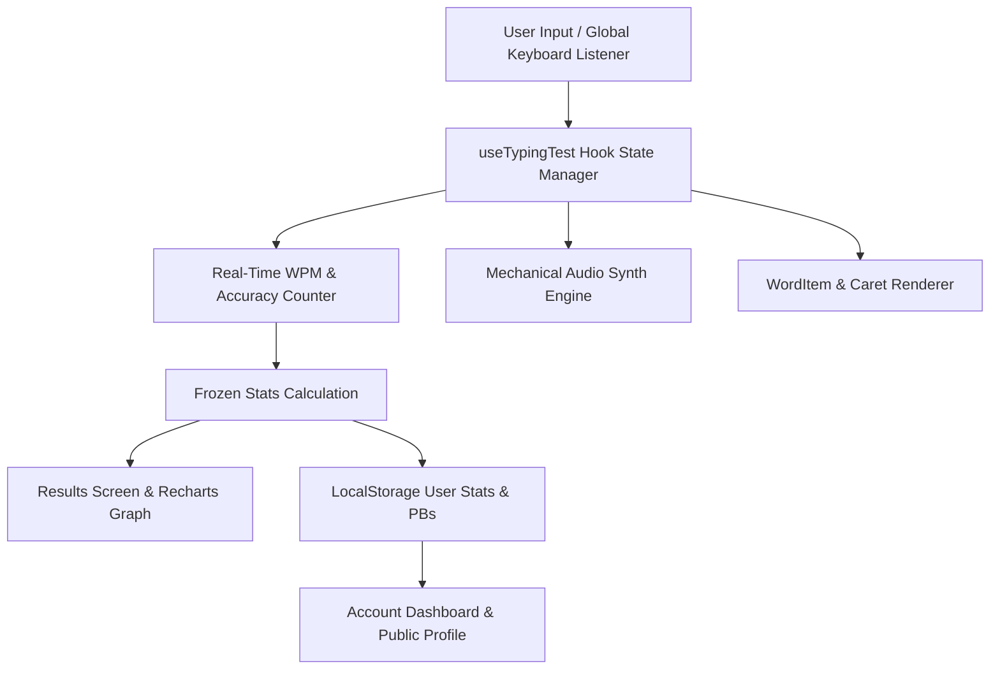

<div align="center">

# ⌨️ Arcitype

**Next-Gen Mechanical Typing Test & Speed Analytics Platform**

Designed & Built with ❤️ by **[Vikash Kumar](https://github.com/vikashkumar302004)**

[](https://nextjs.org/)
[](https://react.dev/)
[](https://www.typescriptlang.org/)
[](https://tailwindcss.com/)
[](LICENSE)

</div>

---

## 🙋‍♂️ Creator's Note & Vision

Hey there! I'm **Vikash Kumar**, the creator of **Arcitype**. 

I built **Arcitype** to redefine how speed typists and mechanical keyboard enthusiasts practice, analyze, and elevate their typing performance. My goal was to combine the tactile satisfaction of authentic mechanical keyboard acoustics with precision speed analytics, ghost racing, and a ultra-sleek modern interface.

Whether you're pushing for 150+ WPM in 15-second sprints, training in **Blind Mode** for raw speed consistency, or competing against a **Pace Caret** ghost cursor, Arcitype is crafted to provide the ultimate typing experience.

---

## 🚀 Key Features

### 🎧 Authentic Mechanical Audio Engine
* **Real Switch Sound Profiles**: Integrated sound profiles for Cherry MX Blue, Red, Brown, Holy Panda, Ink Black, Thock, and Topre switches synthesized live via Web Audio API.
* **Volume & Mute Controls**: Direct audio adjustment with dedicated sound modals.

### 🎯 Pro Gameplay Modes
* **Pace Caret (Ghost Cursor)**: Race against a real-time target pace cursor (60 WPM, 80 WPM, 100 WPM, 120 WPM).
* **Blind Mode**: Train for raw speed focus without distracting red error highlights during the test.
* **Caret Customization**: Line, Block, Underline, and Outline styles with spring-animated **Smooth Caret** physics.
* **Confidence Mode**: `Off`, `On` (no backspacing past completed words), `Max` (no backspacing allowed).
* **Stop on Error**: `Off`, `Letter` (stops at wrong letter), `Word` (stops at space on wrong word).

### ⌨️ Virtual Keycap Heatmap
* **Aligned 6-Row Keycap Layout**: Precision 848px equalized row width virtual keyboard.
* **Real-time Heatmap**: Live key press lighting, error distribution, and finger position guides.

### 📊 Account & Speed Analytics Dashboard
* **Personal Bests Grid**: Tracks 15s, 30s, 60s, 120s time PBs and 10, 25, 50, 100 word PBs dynamically.
* **Live Test History**: Detailed records with WPM, Raw WPM, Accuracy, and Consistency metrics stored in `localStorage`.
* **Public Profile & Friends**: Integrated public profile toggle, custom share link (`/account?user=...`), and friends tab inside Account Settings.

---

## 🏗️ System Architecture

I designed **Arcitype** with a decoupled, component-driven modular architecture ensuring dynamic state reactivity, zero layout thrashing, and zero-latency sound synthesis:



### 📐 Project Structure

```text
Arcitype/
├── app/                        # Next.js 15 App Router pages & layouts
│   ├── account/page.tsx        # User Stats, PBs Grid, Friends & Account Settings
│   ├── globals.css             # Tailwind v4 styles, themes & glassmorphism
│   ├── layout.tsx              # App Root Layout with Providers & SEO Metadata
│   └── page.tsx                # Main Typing Arena
├── components/
│   ├── account/                # User account dashboards & profile cards
│   ├── auth/                   # Login modal & user dropdown menu
│   ├── layout/                 # Site Header, Arcitype Logo & Chrome
│   ├── settings/               # Settings provider & panel dialogs
│   ├── theme/                  # Theme provider & dynamic favicons
│   └── typing/                 # Typing test, WordItem, GhostRacer, Controls
├── hooks/
│   └── use-typing-test.ts      # Core typing state machine & timer hook
├── lib/
│   ├── auth-context.tsx        # Auth state management & user session persistence
│   ├── synth-sound.ts          # Web Audio synth sound generator
│   ├── test-storage.ts         # Test settings local storage reader/writer
│   └── user-stats.ts           # Dynamic test history & personal bests engine
└── public/                     # Static sound assets & icons
```

---

## 🛠️ Tech Stack

* **Framework**: [Next.js 15 (App Router)](https://nextjs.org/)
* **Library**: [React 19](https://react.dev/)
* **Language**: [TypeScript](https://www.typescriptlang.org/)
* **Styling**: [Tailwind CSS v4](https://tailwindcss.com/) & Vanilla CSS Tokens
* **Animations**: [Motion (Framer Motion)](https://motion.dev/)
* **Icons**: [Phosphor Icons](https://phosphoricons.com/)
* **Audio Engine**: Web Audio API & Audio Preloader

---

## ⚡ Quick Start

To run **Arcitype** locally on your machine:

1. **Clone the repository**:
   ```bash
   git clone https://github.com/vikashkumar302004/Arcitype.git
   cd Arcitype
   ```

2. **Install dependencies**:
   ```bash
   npm install
   # or
   bun install
   ```

3. **Start the development server**:
   ```bash
   npm run dev
   ```

4. **Open in browser**:
   Navigate to [http://localhost:3000](http://localhost:3000).

---

## 📜 License & Author

Created and maintained by **[Vikash Kumar](https://github.com/vikashkumar302004)**.

Licensed under the [MIT License](LICENSE).
